# Farm-PJON-LoRa-network <!-- omit in toc -->
Code relating to a small LoRa network for remote monitoring and control.
This is a work in progress.

## Table of contents <!-- omit in toc -->
- [Base stations](#base-stations)
  - [Arduino Nano base station](#arduino-nano-base-station)
  - [Raspberry Pi base station](#raspberry-pi-base-station)
- [Battery voltage monitor and electric fence control](#battery-voltage-monitor-and-electric-fence-control)
  - [Stripboard plans and schematic](#stripboard-plans-and-schematic)
  - [Photos](#photos)
- [Pressure Pump Monitor](#pressure-pump-monitor)
  - [Compiling and software upload](#compiling-and-software-upload)
  - [Stripboard plans and schematics](#stripboard-plans-and-schematics)
  - [Photos](#photos-1)
  - [Future Changes](#future-changes)

## Base stations
### Arduino Nano base station
Currently an Arduino Nano and 40x2 Alphanumeric LCD, thinking of swapping the nano with a raspberry pi to allow better data logging and display over an ip network.
This is still a work in progress.
Needs the lcd graph library I have written to draw graphs on alpha numeric lcds. It is also a work in progress. This can be found [here](https://github.com/jgOhYeah/LCDGraph).

### Raspberry Pi base station
Currently a work in progress and have not uploaded the files to Github yet, but uses a python script to interface with an SX1278 LoRa module and translate this into MQTT to pass to a Thingsboard server running on the pi.

[This](https://github.com/hnlichong/PyLora/tree/py35) branch of the [PyLora library](https://github.com/Inteform/PyLora) is required to talk to the radio module as it has been adapted for python 3.

## Battery voltage monitor and electric fence control
This is code currently in use in a device that is monitoring battery charge in a remote solar powered electric fence. It sends a packet with the battery voltage once every few minutes and listens for an incoming packet for a set time after each tansmission. The incoming packet can tell the device to turn the fence on or off or control other aspects of the radio link such as disabling transmissions until another incoming packet enables them or requesting the current status be resent.

### Stripboard plans and schematic
I used KiCad to plan a layout on veroboard so that I knew there was room for everything and I didn't end up cutting the wrong tracks. The yellow circles and lines in layer `Eco2.User` are where tracks should be cut. The KiCad files can be found [here](BatteryVoltageMonitor/BatteryMonitorVeroboardLayout).
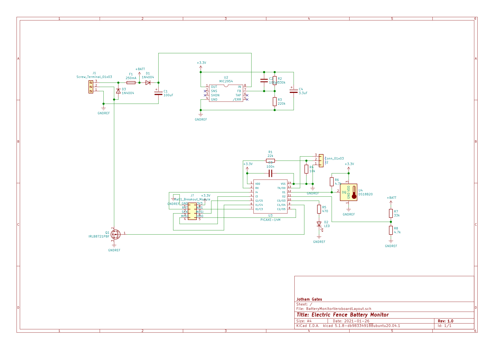
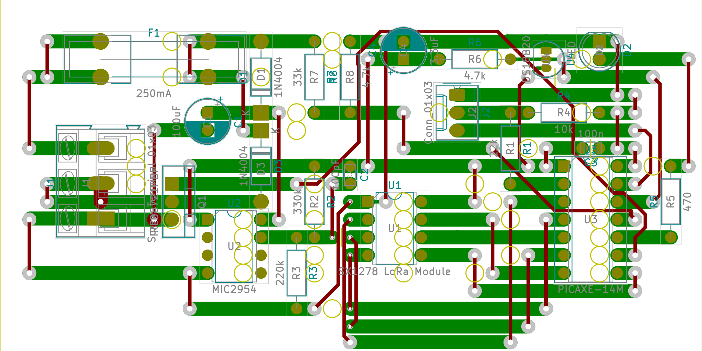

### Photos
This is a work in progess and as such it is only temperarily mounted in the shed, although you know what they say about temporary things :).
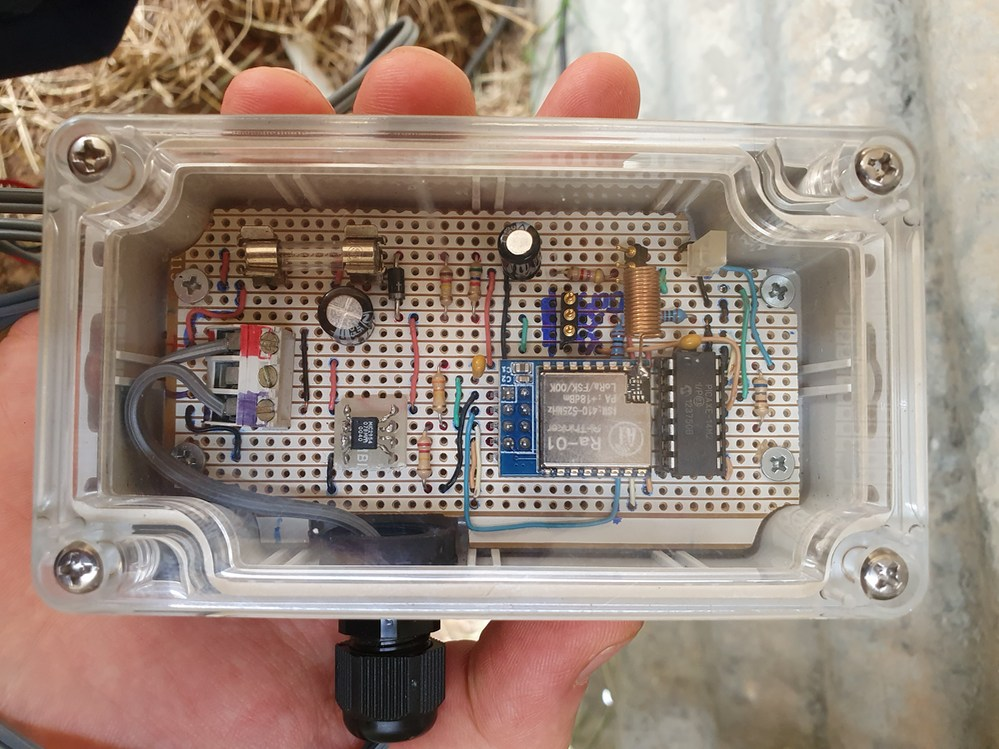

Battery voltage monitor before the mosfet was added for controlling the fence and an external antenna to improve range.

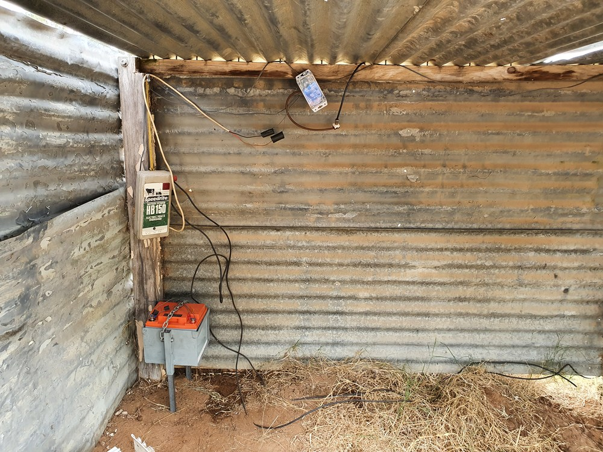

The shed and setup of the battery monitor.

## Pressure Pump Monitor
This is a monitor for the main pressure pump of the farm that allows the on time of the pump to be measured to hopefully detect leaks sooner rather than later.

The monitor currently operates by timing how many half seconds the pump is on in a half hour block. At the end of each block, the monitor saves the time to a circular buffer stored in an EEPROM chip, calculates the average on time for all values in the chip and transmits the time on in the last half hour as well as the average on time as a LoRa radio packet using the PJON protocol for addressing.

To detect when the pump is running, a simple current transformer was made by winding the neutral wire in a mains extension lead around a filtering choke from an old power supply. Some electrical spaghetti insulation was placed over the neutral wire to ensure that there are multiple layers of insulation between the primary coil formed by the neutral wire and the secondary coil formed by the ~100 turns of enamal copper wire originally on the choke. This is amplified and rectified by a pair of transistors on the pump monitor circuit board. The current transformer is not particulary linear and the amplifier was designed to output a digital signal, meaning that precise current measurement is not *currently* an option :). Having said that, the system does seem to be quite reliable in detecting when the pump is on and off.

Using an XL2416CP 16kb EEPROM chip, approximately 20 days worth, or 1023 values can be stored at a time.

### Compiling and software upload
The software to handle the circular buffer and talk to the radio module take up most of the program space. Strings to print using `sertxd` are stored in table memory. To avoid having to calculate string lengths and memory locations, I have been working on an extension to [this](https://github.com/Patronics/PicaxePreprocess) python preprocessor, currently in [this branch](https://github.com/jgOhYeah/PicaxePreprocess/tree/sertxdTableExtension) that will automatically add and call the correct subroutines whenever a `;#sertxd` directive is encountered. If you don't want to use this, you can use the compiled.bas file that will have and the `;#sertxd` directives correctly substituted, or use the standard PICAXE Programming Editor 6 that will ignore them as a comment, leaving code that will work, but with cryptic numbers being all that is printed to the serial console.

### Stripboard plans and schematics
As with the Battery monitor [above](#stripboard-plans-and-schematic), I planned out a layout using Kicad before printing a template and using this to cut tracks and place jumper wires and components in the required places. The Kicad files can be found [here](PumpMonitor/PumpMonitorVeroboardLayout/).
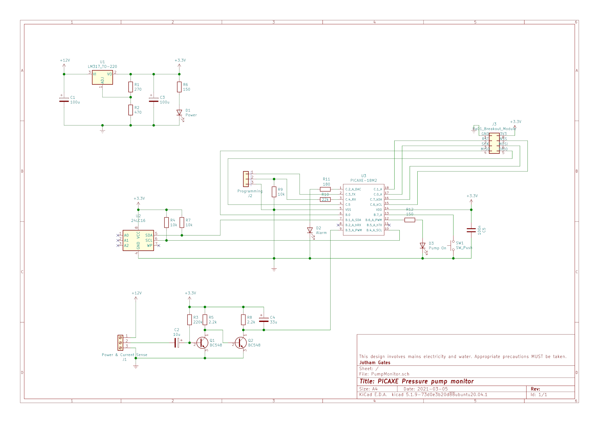
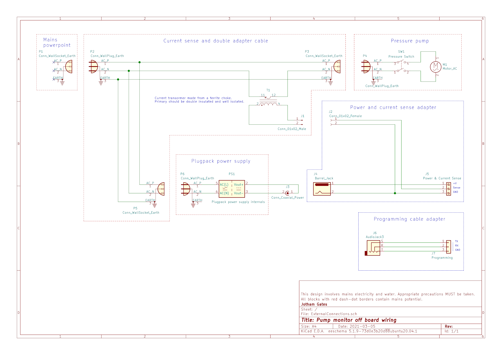
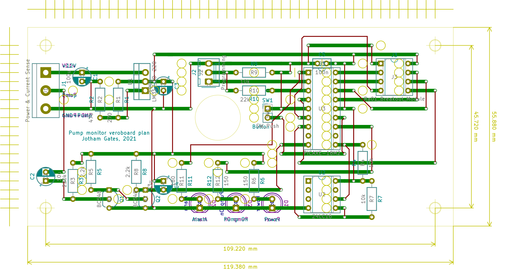

### Photos
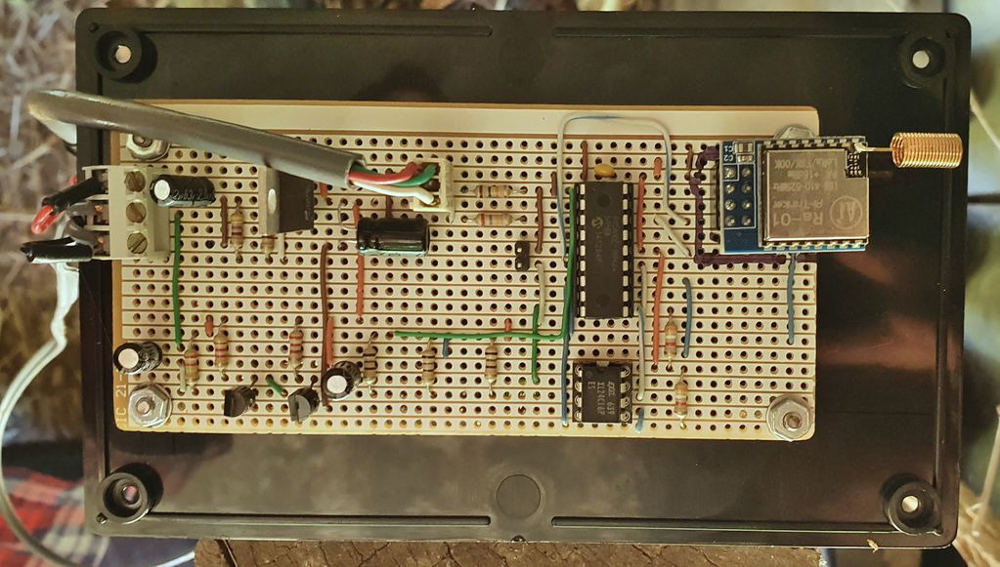

Bird's eye view of the circuit.

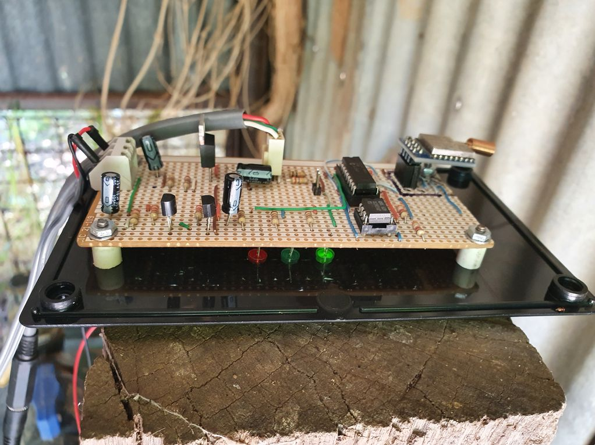

View of the monitor circuit board showing the placement of the indicator LEDs.

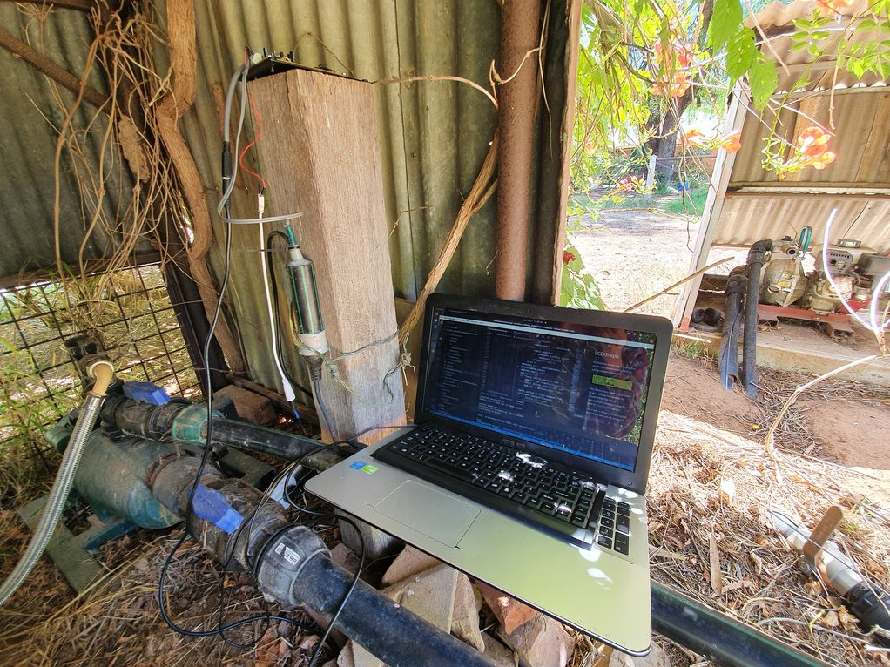

Testing and software development showing the pump and current transformer (inside the green and black poly pipe extension of a mains socket).

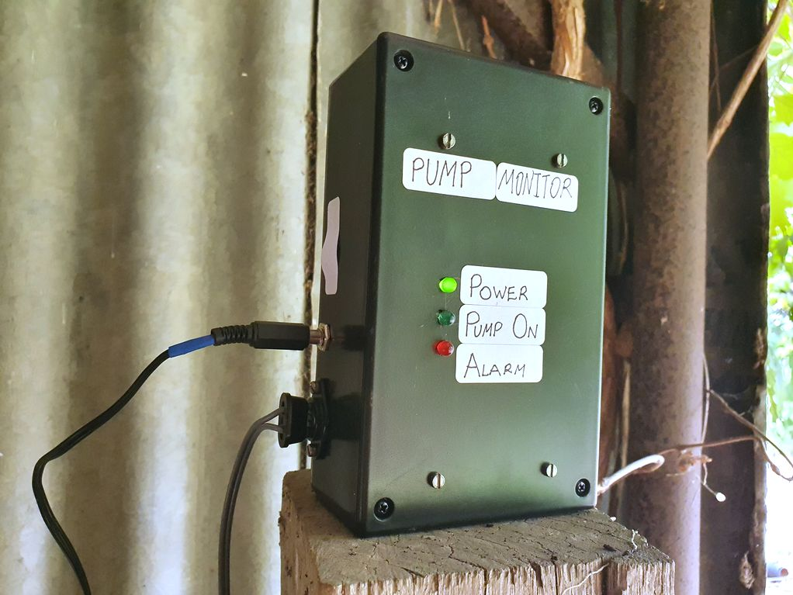

The pump monitor in its box.

### Future Changes
- At the moment, there is no alarm detection, but when I get around to it, I will probably implement it as part of this device to avoid issues caused by the radio link not being completely reliable. It would probably establish a baseline on time where all the pump is doing is running for a few seconds every hour to keep pressure up and raise an alarm if the pump is over this for *X* consecutive blocks of time (i.e. water is being used for an unexpectedly long time or there is a leak). In this way, it would hopefully be fairly sensitive to moderate and high leaks over a few hours, but not raise too many false alarms from watering the gardens and fruit trees.
- Another thing to do is to rewrite the timing code to use interrupts to detect when the pump has started and stopped to avoid the current situation where the pump is not counted as running even if it is during long operations such as calculating the average times.
- I recently found out that the 18m2+ chips have support for multiple slots, so it might be useful to put an eeprom debugging program in slot1 that can be called under a specific set of conditions to save having to reflash the chip and alternate between software whenever debugging needs to be done.
